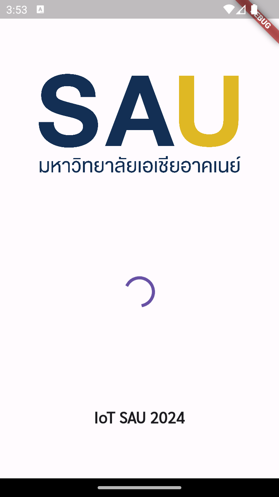
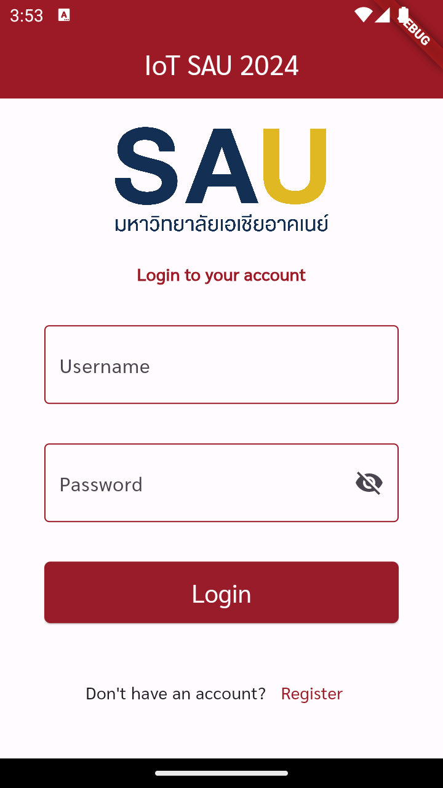
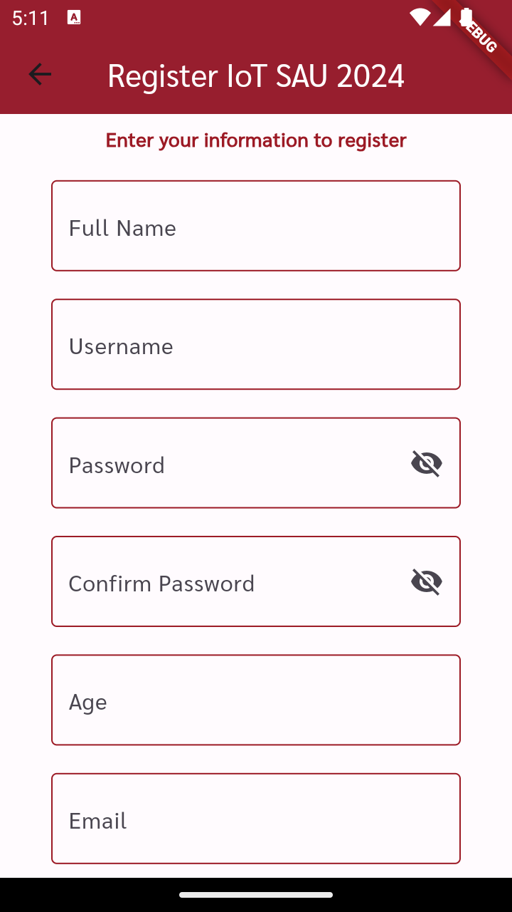

# IoT SAU 2024 - Flutter Project

This project is used to study usage [Flutter](https://flutter.dev/) connect to API.

## Technologies and Tools

- [Flutter](https://flutter.dev/)
- [Dart](https://dart.dev/)
- [Android Studio](https://developer.android.com/studio)

## Project Screenshots

### Slash Screen

### Home Page

### Detail Page

### Login Page

### Register Page

